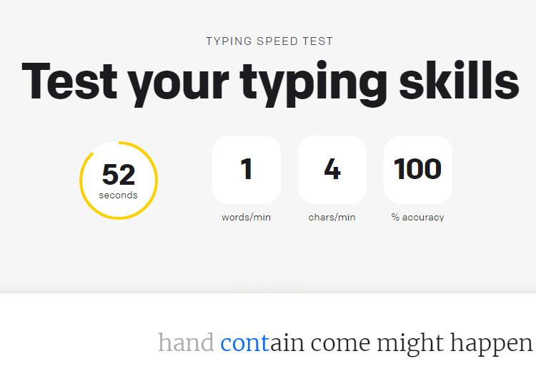

# AutoKB
<p align="center"> 

</p>

[](https://www.python.org/)
[](https://github.com/ellerbrock/open-source-badges/)

## Introduction
> I was inspired to do this when I first saw pytesseract. 
> This project is able to type based on what letters it sees on the screen. 
> This program was designed for the type test at [this](https://www.livechat.com/typing-speed-test/#/) site. 
> The image recognition is not 100% accurate but it works well.

## Tesseract Setup
> Download the latest version [here](https://github.com/UB-Mannheim/tesseract/wiki), then run:
```bash
pip install pytesseract
```

## Installation

First clone the repository.
```bash
git clone https://github.com/swishyDev/autoKB.git your-project-name
```
Then run this file
```bash
cd your-project-name
python main.py
```

## Contributing
All pull requests are welcome.


## License
[MIT](https://choosealicense.com/licenses/mit/)
